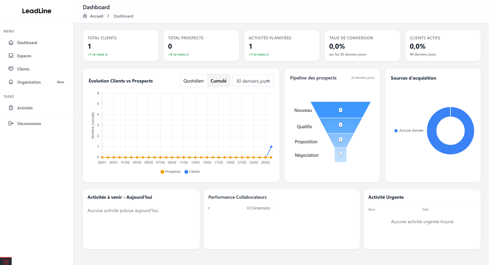

# Leadline — Pipeline Prospect CRM

   



A lightweight CRM to keep your prospects, clients, and activities in one place. Leadline was built as a BTS SIO SLAM (E5) project: a real pipeline you can run locally, with spaces, lists, conversions, and a simple dashboard so nothing slips through the cracks.

---

## Table of contents

- [What it does](#what-it-does)
- [Context & goals](#context--goals)
- [User journey](#user-journey)
- [Tech stack](#tech-stack)
- [Quick start](#quick-start)
- [Configuration](#configuration)
- [Data model](#data-model)
- [Architecture](#architecture)
- [Main routes](#main-routes)
- [Features at a glance](#features-at-a-glance)
- [How the pipeline works](#how-the-pipeline-works)
- [Troubleshooting](#troubleshooting)
- [Possible extensions](#possible-extensions)

---

## What it does

You get **organizations** (one per tenant). Inside each, **spaces** group work by theme; each space has **lists**, and each list holds **prospects**. When a prospect is ready, you **convert** them into a **client** (stored once, linked to activities). **Activities** (meetings, callbacks) are dated and can be attached to prospects or clients. The **dashboard** shows KPIs (conversion rate, active clients), a **funnel** (new → contacted → interested → converted), acquisition sources, and today’s or urgent activities. Access is controlled by **roles and permissions** (admin, manager, collaborator, pending).

---

## Context & goals

- **Context:** School project (BTS SIO – SLAM, E5) — a “client léger” web app to demonstrate a full Laravel stack and a clear UX.
- **Goals:** Centralise prospects and clients; organise work with spaces and lists; plan activities and track history; enforce access with RBAC; keep the UI clean, responsive, and easy to use (Tailwind, modals, no clutter).

---

## User journey

1. **Landing** → Register or log in.
2. **Dashboard** → See counts, funnel, charts, today’s and urgent activities.
3. **Spaces** → Create or open a space → **Lists** inside it → **Prospects** in each list (add, edit, delete, **convert to client**).
4. **Clients** → View and manage the consolidated client base (from converted prospects).
5. **Activities** → Create and manage activities (date, time, description, link to prospect/client).
6. **Organization** → Invite users (invitation link), assign **roles** and **permissions** (manage users, assign roles, validate users).
7. **Profile** → Edit profile or delete account.

---

## Tech stack

- **Backend:** Laravel 10 (PHP 8.1+), MVC, Eloquent.
- **Frontend:** Blade, Tailwind CSS, vanilla JS (modals, confirmations).
- **Database:** MySQL 8.
- **Tooling:** Composer, Node/npm (Vite for assets), optional: PHPMyAdmin, Plesk.

---

## Quick start

### Prerequisites

- **PHP** ≥ 8.1 (8.2+ recommended)
- **Composer** ≥ 2
- **Node.js** ≥ 18 and **npm**
- **MySQL** ≥ 8
- Git

### Setup

1. **Clone and enter the project**

   ```bash
   git clone https://github.com/yhn-dm/leadline-pipeline-prospect-project.git
   cd leadline-pipeline-prospect-project
   ```

2. **Install dependencies**

   ```bash
   composer install
   npm install
   npm run dev
   ```
   Use `npm run build` for production assets.

3. **Environment**

   ```bash
   cp .env.example .env
   php artisan key:generate
   ```
   Set your MySQL credentials in `.env` (`DB_HOST`, `DB_DATABASE`, `DB_USERNAME`, `DB_PASSWORD`). Optionally set `APP_NAME`, `APP_URL`, and `MAIL_*` if you use mail.

4. **Database**

   ```bash
   php artisan migrate --seed
   ```

5. **Storage (if you use file uploads)**

   ```bash
   php artisan storage:link
   ```

6. **Run the app**

   ```bash
   php artisan serve
   ```
   Open **http://localhost:8000**.

---

## Configuration

Relevant `.env` keys:

| Key | Purpose |
|-----|--------|
| `APP_NAME`, `APP_URL` | App name and base URL (e.g. `http://localhost:8000`) |
| `DB_CONNECTION`, `DB_HOST`, `DB_DATABASE`, `DB_USERNAME`, `DB_PASSWORD` | MySQL connection |
| `MAIL_*` | Optional; for password reset or notifications |

Nothing else is required for a basic local run.

---

## Data model

- **organizations** — One per tenant; users belong to one organization.
- **users** — Name, email, password; `organization_id`; linked to roles via `role_user`.
- **roles** & **permissions** — Many-to-many; e.g. “manage users”, “assign roles”, “validate users”.
- **spaces** — Name, description, status (active/archived). Belong to the org; have many lists.
- **lists** — Name, description, status; `space_id`; contain prospects. Access can be restricted per user (e.g. collaborators).
- **prospects** — Name, email, phone, comment, status (new, contacted, interested, converted, lost, client), source_acquisition, priority; `list_id`, optional `status_id`, optional `collaborator_id`.
- **clients** — Name, email, phone, description; created when a prospect is converted (optional `converted_by` user).
- **activities** — date, time, description; many-to-many with prospects and clients (pivot tables).
- **invitations** — Token for sign-up link; ties a new user to an organization.

The funnel on the dashboard uses prospect **status** over the last 30 days: top = new, then contacted, then interested; bottom = new clients (from `clients` created in that window).

---

## Architecture

- **MVC:** Models in `app/Models`, HTTP controllers in `app/Http/Controllers`, views in `resources/views`.
- **Auth:** Laravel Breeze-style (registration, login, password reset); routes in `routes/auth.php` and `web.php`.
- **Key controllers:** `DashboardController` (KPIs, funnel, charts, today/urgent activities); `SpaceController`, `ListController`, `ProspectController`, `ClientController`, `ActivityController` (CRUD); `OrganizationController`, `UserController` (org, invites, roles/permissions); `StatusController` (statuses per space).
- **Middleware:** `auth`, `verified`, and permission-based (`permission:manage users`, `permission:assign roles`, etc.).
- **Views:** Layouts (`app.blade.php`, sidebar), Blade views per resource; modals for create/edit where it makes sense; Tailwind for styling.

No need to paste the full directory tree here — the structure above is enough to find your way around.

---

## Main routes

| Method | Path / group | Purpose |
|--------|----------------|--------|
| GET | `/` | Landing |
| GET | `/dashboard` | Dashboard (auth, verified) |
| GET/POST | `/register`, `/login`, … | Auth (see `auth.php`) |
| GET/PATCH/DELETE | `/profile/*` | Profile |
| Resource | `/organizations` | Organization CRUD |
| POST | `/organizations/invite` | Generate invitation link |
| GET/POST | `/organization/*` | Users, roles, permissions (guarded by permissions) |
| GET/POST/… | `/spaces`, `/spaces/{id}/statuses` | Spaces and statuses |
| GET/POST/PUT/DELETE | `/lists/{space}`, `/lists/{space}/{list}` | Lists in a space |
| GET/POST/… | `/lists/{list}/prospects`, `/lists/{list}/prospects/{id}`, convert | Prospects in a list |
| Resource | `/clients` | Clients |
| Resource | `/activities` | Activities |

---

## Features at a glance

- **Auth:** Register, login, logout, password reset, email verification.
- **Spaces:** Create, edit, archive, delete; assign collaborators.
- **Lists:** Create, edit, delete inside a space; assign collaborators.
- **Prospects:** Full CRUD; convert to client (creates client, link kept).
- **Clients:** View, create, edit, delete (consolidated base).
- **Activities:** Create, edit, delete; date, time, description; link to prospect/client; list today’s and urgent on dashboard.
- **Organization:** Invite via link; assign roles and permissions (RBAC).
- **Dashboard:** Totals, 30-day conversion rate, active clients %, variations (e.g. 30d vs previous 30d), funnel (new → contacted → interested → converted), acquisition pie chart, daily/cumulative series, today’s and urgent activities.
- **UI:** Responsive, Tailwind, modals where useful, consistent buttons and forms.

---

## How the pipeline works

- **Funnel (dashboard):** Last 30 days. Top = prospects with status `new`; then `contacted`; then `interested`; bottom = new **clients** created in that period. So you see the flow from “new lead” to “won”.
- **Conversion:** From a prospect screen, “Convert to client” creates a **client** record (name, email, phone, etc.) and optionally marks or handles the prospect so it doesn’t double-count. Clients are global to the org; activities can be attached to them.
- **Acquisition sources:** Prospect field `source_acquisition` is bucketed (e.g. Marketing, Référ., RS, Autre) and shown as a pie on the dashboard (last 90 days, or full history if empty).
- **Roles:** Admin (full access), Manager (own scope, no role management), Collaborator (assigned spaces/lists), Pending (invited but not yet granted access). Permissions gate routes (e.g. manage users, assign roles, validate users).

---

## Troubleshooting

- **Database connection failed:** Create the MySQL database named in `DB_DATABASE`; check `DB_USERNAME` and `DB_PASSWORD` in `.env`. Run `php artisan migrate` again.
- **Port 8000 in use:** Start the server on another port, e.g. `php artisan serve --port=8080`, and set `APP_URL` accordingly.
- **Blank or broken dashboard:** Run migrations and seed; ensure you have at least one user and, if the funnel/charts expect data, a few prospects and clients. Check the browser console for JS errors (e.g. Chart.js / funnel script).

---

## Possible extensions

- **Search & filters:** Search prospects/clients by name or email; filter lists by status or date.
- **REST API:** Expose spaces, lists, prospects, clients for mobile or external tools.
- **Notifications:** Email or in-app reminders for activities (e.g. “tomorrow at 9”).
- **Export:** Export lists or prospects to CSV/Excel from the UI.

---

*Academic project — BTS SIO SLAM 2025. Repository: [yhn-dm/leadline-pipeline-prospect-project](https://github.com/yhn-dm/leadline-pipeline-prospect-project).*
